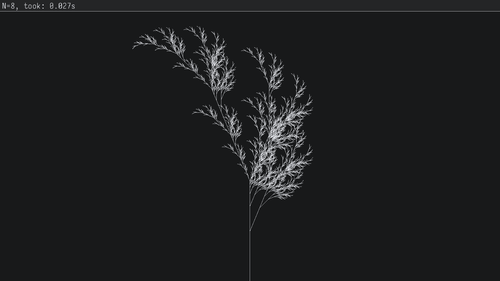

# l-system

[L-systems](https://en.wikipedia.org/wiki/L-system) implemented in Rust.

## Example

```math
\begin{align}
&start = X \\
&F \rightarrow FF \\
&X \rightarrow F-[[X]+X]+F[+FX]-X \\
&\theta = 22.5
\end{align}
```


